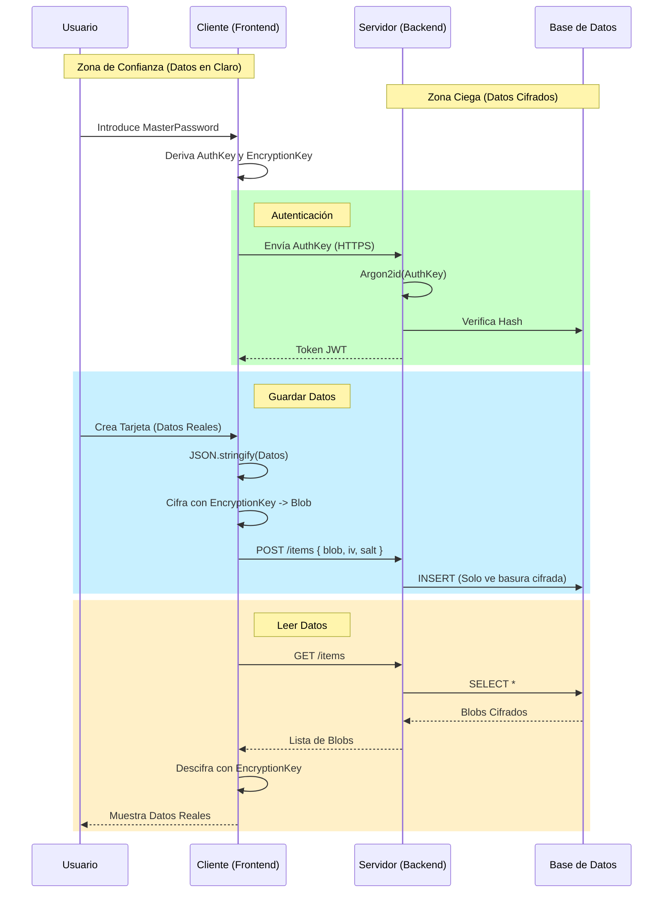

# Flujo de Datos y Arquitectura de Seguridad (Zero Knowledge)

Este documento detalla cómo fluyen los datos a través de Alcatraz, con un enfoque específico en la arquitectura de **Conocimiento Cero (Zero Knowledge)**. El principio fundamental es que **el servidor nunca ve ni tiene acceso a los datos en texto plano ni a la contraseña maestra del usuario.**

## 1. Conceptos Clave

### Roles
- **Cliente (Frontend)**: Responsable de **toda** la criptografía (cifrado y descifrado). Es el único lugar donde existe la Contraseña Maestra en memoria.
- **Servidor (Backend)**: Actúa como un almacén ciego. Solo guarda blobs cifrados y gestiona la autenticación, pero no puede leer el contenido de los items.

### Secretos del Usuario
El usuario tiene una **Contraseña Maestra**. De ella se derivan dos claves criptográficas distintas:
1.  **Clave de Autenticación (`AuthKey`)**: Usada para loguearse en la API.
2.  **Clave de Cifrado (`EncryptionKey`)**: Usada para cifrar/descifrar los datos de la bóveda.

---

## 2. Flujo de Autenticación (Login)

El objetivo es probar la identidad del usuario sin enviar la contraseña maestra al servidor.

1.  **Input del Usuario**: El usuario introduce su `MasterPassword`.
2.  **Derivación en Cliente**:
    - El frontend calcula: `AuthKey = Hash(MasterPassword, Salt_Auth)`.
    - *Nota: `Salt_Auth` suele ser el email o una constante conocida por el cliente.*
3.  **Envío**: El cliente envía la `AuthKey` (como si fuera la contraseña) al backend a través de HTTPS.
4.  **Verificación en Servidor**:
    - El backend recibe la `AuthKey`.
    - El backend aplica su propio hashing (Argon2id): `StoredHash = Argon2id(AuthKey, Salt_DB)`.
    - Compara `StoredHash` con el hash guardado en la base de datos.
    - **Importante**: El backend solo guarda el resultado del doble hashing. Incluso si el backend es comprometido, el atacante no obtiene la `MasterPassword` ni la `AuthKey` original fácilmente.
5.  **Respuesta**: Si es válido, el servidor devuelve un **Token JWT**.

---

## 3. Flujo de Datos de la Bóveda (Items)

Aquí es donde se aplica Zero Knowledge.

### A. Creación de un Item (Escritura)

1.  **Preparación de Datos (Cliente)**:
    - El usuario rellena el formulario (ej. Tarjeta de Crédito).
    - El frontend crea un objeto JSON:
      ```json
      {
        "holder": "Juan Perez",
        "number": "4111222233334444",
        "cvv": "123"
      }
      ```
2.  **Cifrado (Cliente)**:
    - El frontend deriva (si no la tiene ya en memoria) la `EncryptionKey` desde la `MasterPassword`.
    - Genera un **IV** (Vector de Inicialización) aleatorio y una **Salt** aleatoria para este item.
    - Cifra el JSON usando AES-256-GCM (o algoritmo similar) con la `EncryptionKey`.
    - Resultado: Un string Base64 ilegible (`EncryptedData`).
3.  **Envío a la API**:
    - El cliente envía al backend:
      ```json
      {
        "type": "card",
        "title": "Mi Visa",
        "encrypted_data": "a8f9c2e...", // Blob cifrado
        "iv": "...",
        "salt": "..."
      }
      ```
4.  **Persistencia (Servidor)**:
    - El backend valida el token JWT.
    - El backend guarda los datos tal cual en la base de datos. **No sabe qué hay dentro de `encrypted_data`**.

### B. Lectura de Items (Lectura)

1.  **Solicitud**: El cliente pide "Dame mis items".
2.  **Respuesta del Servidor**: El servidor devuelve la lista de items con sus `EncryptedData`, `IV` y `Salt`.
3.  **Descifrado (Cliente)**:
    - El cliente itera sobre cada item.
    - Usa su `EncryptionKey` (en memoria), el `IV` y la `Salt` del item para descifrar `EncryptedData`.
    - Obtiene el JSON original y renderiza la UI correspondiente (Tarjeta, Nota, Contraseña, etc.).

---

## 4. Diagrama de Seguridad


