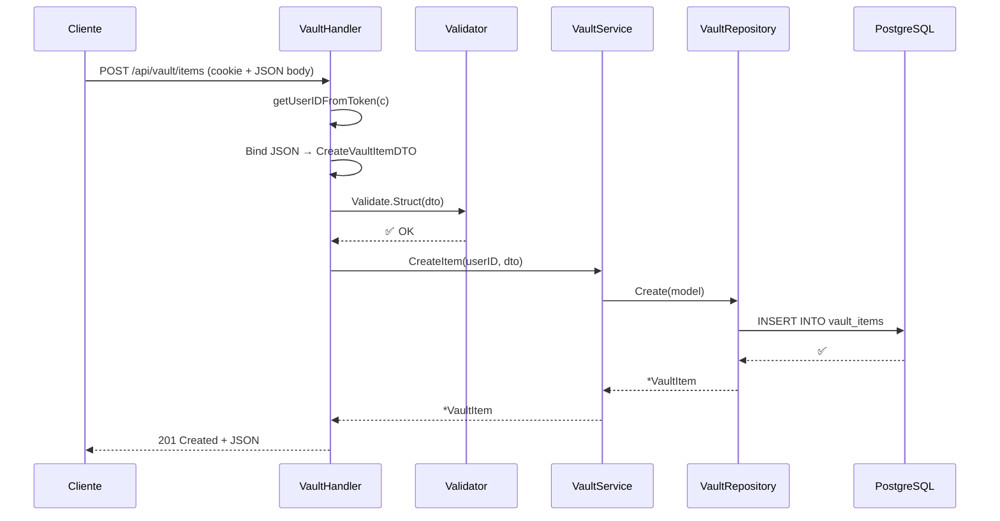

# 📦 Handlers Package (`handlers`)

Este paquete contiene los **Controladores HTTP** de la aplicación. Es la capa de transporte que conecta las peticiones HTTP con la lógica de negocio.

---

## Responsabilidades

1. **Recibir peticiones** HTTP en los endpoints definidos por `routes`
2. **Parsear entrada**: extraer parámetros de URL, body JSON, cookies
3. **Validar** datos de entrada usando DTOs + `validator`
4. **Delegar** la lógica de negocio al Service correspondiente
5. **Formatear respuestas** HTTP: JSON + código de estado apropiado

> ⚠️ Los handlers **NO** contienen lógica de negocio. Solo orquestan el flujo HTTP.

---

## Archivos y Componentes

### `auth.go` — `AuthHandler`

Gestiona el ciclo de autenticación completo.

| Método | Endpoint | HTTP | Descripción |
|---|---|---|---|
| `Register` | `/api/auth/register` | `POST` | Registra un nuevo usuario |
| `Login` | `/api/auth/login` | `POST` | Autentica y establece cookie JWT |
| `Logout` | `/api/auth/logout` | `POST` | Expira la cookie JWT |

#### Flujo de Login
1. Parsea el body a `dto.LoginDTO`
2. Valida campos con `validator`
3. Llama a `authService.Login(login)` → obtiene token JWT
4. Establece cookie `auth_token` (`HttpOnly`, `SameSite=Lax`, 12h)
5. Responde `200 OK`

#### Flujo de Logout
1. Sobrescribe la cookie `auth_token` con valor vacío y `MaxAge: -1`
2. Responde `200 OK`

---

### `vault.go` — `VaultHandler`

CRUD completo de items de la bóveda. Todas las operaciones requieren autenticación.

| Método | Endpoint | HTTP | Descripción |
|---|---|---|---|
| `CreateItem` | `/api/vault/items` | `POST` | Crea un nuevo item cifrado |
| `GetItems` | `/api/vault/items` | `GET` | Lista todos los items (sin secretos) |
| `GetItem` | `/api/vault/items/:id` | `GET` | Obtiene un item con su secreto |
| `UpdateItem` | `/api/vault/items/:id` | `PUT` | Actualiza un item |
| `DeleteItem` | `/api/vault/items/:id` | `DELETE` | Elimina un item (soft delete) |

#### Patrón de Seguridad
Cada handler extrae el `userID` del token JWT via `getUserIDFromToken(c)`. Esto garantiza que un usuario solo acceda a sus propios datos.

---

### `user_profile.go` — `UserProfileHandler`

Gestión del perfil público del usuario.

| Método | Endpoint | HTTP | Descripción |
|---|---|---|---|
| `GetProfile` | `/api/user/profile` | `GET` | Obtiene el perfil del usuario |
| `UpdateProfile` | `/api/user/profile` | `PUT` | Actualiza nombre, avatar o idioma |

#### Flujo de UpdateProfile
1. Extrae `userID` del token JWT
2. Parsea body a `dto.UpdateUserProfileDTO`
3. Valida con `validator`
4. Solo actualiza campos no vacíos (partial update)
5. Llama a `userService.UpdateProfile()`

---

## Utilities

### `getUserIDFromToken(c echo.Context) string`

Función helper compartida entre todos los handlers protegidos:

```go
func getUserIDFromToken(c echo.Context) string {
    userToken, ok := c.Get("user").(*jwt.Token)
    // ... extrae claims["user_id"]
}
```

Extrae el claim `user_id` del token JWT presente en el contexto de Echo (inyectado por el middleware JWT).

---

## Códigos de Respuesta

| Código | Significado | Cuándo se usa |
|---|---|---|
| `200 OK` | Operación exitosa | Login, Get, Update |
| `201 Created` | Recurso creado | Register, CreateItem |
| `204 No Content` | Eliminación exitosa | DeleteItem |
| `400 Bad Request` | Datos de entrada inválidos | Validación fallida |
| `401 Unauthorized` | Token JWT inválido o ausente | Endpoints protegidos |
| `404 Not Found` | Recurso no encontrado | GetItem, GetProfile |
| `409 Conflict` | Email ya registrado | Register |
| `500 Internal Server Error` | Error interno del servidor | Errores inesperados |

---

## Ejemplo de Flujo Completo (CreateItem)


