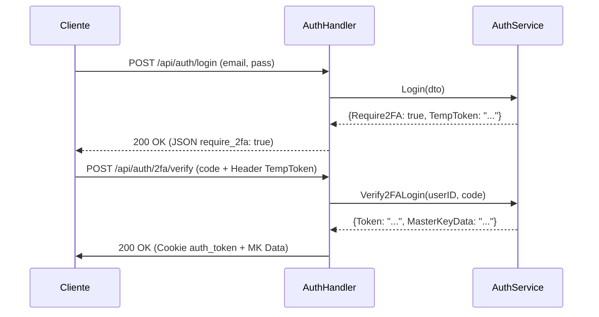

# 📦 Handlers Package (`handlers`)

Este paquete contiene los **Controladores HTTP** de la aplicación. Es la capa de transporte que conecta las peticiones HTTP con la lógica de negocio.

---

## Responsabilidades

1. **Recibir peticiones** HTTP en los endpoints definidos por `routes`
2. **Parsear entrada**: extraer parámetros de URL, body JSON, cookies, headers
3. **Validar** datos de entrada usando DTOs + `validator`
4. **Delegar** la lógica de negocio al Service correspondiente
5. **Formatear respuestas** HTTP: JSON + código de estado apropiado

---

## Archivos y Componentes

### `auth.go` — `AuthHandler`

Gestiona la autenticación, 2FA y recuperación de cuenta.

| Método | Endpoint | HTTP | Descripción |
|---|---|---|---|
| `Register` | `/api/auth/register` | `POST` | Registra un nuevo usuario |
| `Login` | `/api/auth/login` | `POST` | Autentica y establece cookie JWT o requiere 2FA |
| `Verify2FALogin` | `/api/auth/2fa/verify` | `POST` | Verifica TOTP para completar el login |
| `Logout` | `/api/auth/logout` | `POST` | Expira la cookie JWT |
| `UserExists` | `/api/auth/exists` | `GET` | Verifica si un email ya está registrado |
| `Setup2FA` | `/api/user/2fa/setup` | `POST` | Genera secreto TOTP (Protegido) |
| `Enable2FA` | `/api/user/2fa/enable` | `POST` | Activa 2FA con validación (Protegido) |
| `ChangeMasterPassword`| `/api/user/change-password`| `POST` | Actualiza password maestro (Protegido) |
| `FetchRecoveryData` | `/api/auth/recovery/fetch` | `POST` | Obtiene metadata para recuperación |
| `ResetPassword` | `/api/auth/recovery/reset` | `POST` | Resetea password con Recovery Key |

---

### `vault.go` — `VaultHandler`

Gestión de items y carpetas de la bóveda.

| Método | Endpoint | HTTP | Descripción |
|---|---|---|---|
| `CreateItem` | `/api/vault/items` | `POST` | Crea un nuevo item cifrado |
| `GetItems` | `/api/vault/items` | `GET` | Lista todos los items activos |
| `GetTrash` | `/api/vault/trash` | `GET` | Lista items en la papelera |
| `GetItem` | `/api/vault/items/:id` | `GET` | Obtiene un item con su secreto |
| `UpdateItem` | `/api/vault/items/:id` | `PUT` | Actualiza un item |
| `MoveToTrash` | `/api/vault/items/:id` | `DELETE` | Mover a la papelera (soft delete) |
| `RestoreItem` | `/api/vault/items/:id/restore`| `POST` | Restaurar de la papelera |
| `DeleteItem` | `/api/vault/items/:id/permanent`| `DELETE` | Eliminación física definitiva |
| `CreateFolder` | `/api/vault/folders` | `POST` | Crea una nueva carpeta |
| `GetFolders` | `/api/vault/folders` | `GET` | Lista todas las carpetas |
| `UpdateFolder` | `/api/vault/folders/:id` | `PUT` | Renombra una carpeta |
| `DeleteFolder` | `/api/vault/folders/:id` | `DELETE` | Elimina una carpeta |

---

### `user_profile.go` — `UserProfileHandler`

Gestión del perfil y eliminación de cuenta.

| Método | Endpoint | HTTP | Descripción |
|---|---|---|---|
| `GetProfile` | `/api/user/profile` | `GET` | Obtener perfil actual |
| `UpdateProfile` | `/api/user/profile` | `PUT` | Actualizar datos del perfil |
| `DeleteAccount` | `/api/user/account` | `DELETE` | Eliminar cuenta y todos sus datos |

---

## Utilities

### `getUserIDFromToken(c echo.Context) uuid.UUID`

Extrae el UUID del usuario desde los claims del token JWT. Valida que el token sea válido y esté presente en el contexto (inyectado por el middleware JWT).

---

## Códigos de Respuesta

| Código | Significado | Cuándo se usa |
|---|---|---|
| `200 OK` | Operación exitosa | Login, Get, Update, Recovery |
| `201 Created` | Recurso creado | Register, CreateItem, CreateFolder |
| `204 No Content` | Eliminación exitosa | MoveToTrash, DeleteItem, DeleteFolder |
| `400 Bad Request` | Datos inválidos | Fallo de validación, 2FA incorrecto |
| `401 Unauthorized` | No autorizado | Token inválido, credenciales erróneas |
| `404 Not Found` | No encontrado | Item/Carpeta inexistente |
| `409 Conflict` | Conflicto | Email ya registrado |
| `500 Internal Server Error`| Error interno | Errores de base de datos o lógica |

---

## Ejemplo de Flujo: Login con 2FA

