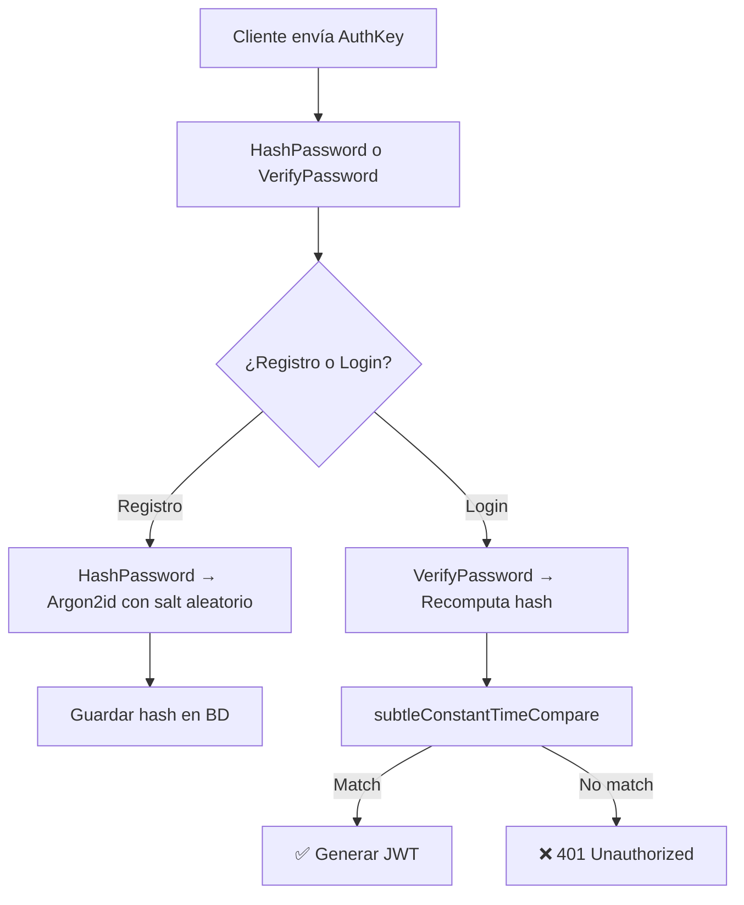

# 📦 Security Package (`security`)

Provee utilidades criptográficas críticas para la seguridad del backend. Implementa el hashing de contraseñas con **Argon2id** siguiendo las recomendaciones de [OWASP](https://cheatsheetseries.owasp.org/cheatsheets/Password_Storage_Cheat_Sheet.html).

---

## Responsabilidades

- Hashear contraseñas (AuthKey) durante el registro
- Verificar contraseñas durante el login
- Detección de parámetros obsoletos para re-hash
- Comparación segura contra ataques de tiempo

---

## Archivos

### `hash.go` — Argon2id Hashing

#### Parámetros por Defecto (`DefaultParams`)

```go
var DefaultParams = ArgonParams{
    Memory:      64 * 1024,  // 64 MB
    Iterations:  3,          // 3 pasadas
    Parallelism: 2,          // 2 threads
    SaltLength:  16,         // 16 bytes
    KeyLength:   32,         // 32 bytes
}
```

| Parámetro | Valor | Significado |
|---|---|---|
| **Memory** | 64 MB | Memoria usada por Argon2id |
| **Iterations** | 3 | Número de pasadas sobre la memoria |
| **Parallelism** | 2 | Threads paralelos |
| **SaltLength** | 16 bytes | Longitud del salt aleatorio |
| **KeyLength** | 32 bytes | Longitud del hash resultante |

#### Funciones

| Función | Firma | Descripción |
|---|---|---|
| `HashPassword` | `(password string) (string, error)` | Genera hash Argon2id con salt aleatorio |
| `VerifyPassword` | `(password, encoded string) (bool, error)` | Verifica una contraseña contra un hash |
| `NeedsRehash` | `(encoded string, current ArgonParams) (bool, error)` | Detecta si un hash usa parámetros obsoletos |

#### Formato del Hash

El hash resultante se almacena en formato PHC string:

```
$argon2id$v=19$m=65536,t=3,p=2${salt_base64}${hash_base64}
```

Ejemplo:
```
$argon2id$v=19$m=65536,t=3,p=2$dGVzdHNhbHQ$aWRrZXloYXNo
```

#### Comparación de Tiempo Constante

La función `subtleConstantTimeCompare` previene **timing attacks** al comparar hashes:

```go
func subtleConstantTimeCompare(a, b []byte) bool {
    if len(a) != len(b) {
        return false
    }
    var diff byte
    for i := range a {
        diff |= a[i] ^ b[i]   // XOR bit a bit
    }
    return diff == 0
}
```

> 🔒 Nunca se usa `==` ni `bytes.Equal()` para comparar hashes. El operador XOR asegura que el tiempo de comparación es constante independientemente de cuántos bytes coincidan.

---

### `hash_test.go` — Tests Unitarios

| Test | Qué verifica |
|---|---|
| `TestHashPasswordAndVerifyPassword` | Contraseña correcta → `true`, incorrecta → `false`, hashes diferentes por salt aleatorio |
| `TestVerifyPasswordInvalidFormat` | Formato de hash inválido devuelve error |
| `TestNeedsRehash` | Detecta cambio de parámetros para re-hash |

Ejecutar tests:

```bash
go test ./security/ -v
```

---

## Uso en la Capa de Services

```go
// Registro: hashear la AuthKey recibida del cliente
hashedPassword, err := security.HashPassword(registerDTO.Password)

// Login: verificar la AuthKey contra el hash almacenado
match, err := security.VerifyPassword(loginDTO.Password, user.PasswordHash)
```

---

## Flujo de Seguridad


