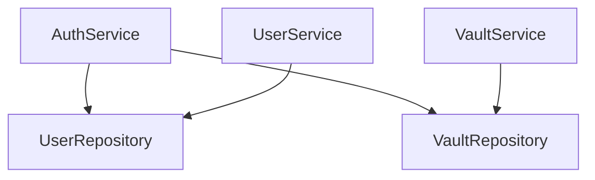

# 📦 Services Package (`services`)

Encapsula la **Lógica de Negocio** de la aplicación. Es el núcleo funcional que orquesta operaciones entre los Handlers y los Repositories.

---

## Responsabilidades

1. **Reglas de negocio**: Validaciones lógicas (2FA, permisos de acceso, integridad de carpetas)
2. **Transformación de datos**: Convertir DTOs → Models y viceversa
3. **Seguridad**: Gestión de tokens JWT, hashing, y validación de TOTP
4. **Criptografía**: Manejo de metadatos de Master Key (Zero Knowledge)
5. **Transaccionalidad**: Garantizar consistencia en operaciones complejas (ej. eliminar carpeta)

---

## Independencia de Transporte

Los services son agnósticos al protocolo (HTTP/gRPC/CLI). Trabajan con tipos de dominio y tipos básicos (UUID, string).

---

## Archivos e Interfaces

### `auth_service.go` — `AuthService`

Gestiona el ciclo completo de identidad y seguridad del usuario.

```go
type AuthService interface {
    Register(dto.RegisterDTO) error
    Login(dto.LoginDTO) (*dto.LoginResponseDTO, error)
    UserExists(email string) (bool, error)
    Generate2FASecret(userID uuid.UUID) (*dto.Setup2FAResponseDTO, error)
    Enable2FA(userID uuid.UUID, dto.Enable2FADTO) ([]string, error)
    Verify2FALogin(userID uuid.UUID, code string) (*dto.LoginResponseDTO, error)
    ChangeMasterPassword(userID uuid.UUID, dto.ChangeMasterPasswordDTO) error
    FetchRecoveryData(email string) (*models.User, error)
    ResetPasswordWithRecoveryKey(dto.ResetPasswordDTO) error
}
```

#### Características Clave:
- **MFA (2FA)**: Soporte para TOTP y Backup Codes. Al loguearse, si el 2FA está activo, se emite un token temporal de 10 minutos para el paso de verificación.
- **Recovery Key**: Permite recuperar el acceso a la cuenta (incluyendo la Master Key cifrada) sin conocer la contraseña anterior, usando una clave de recuperación generada al registrarse.
- **Zero Knowledge**: Almacena el `ProtectedMasterKey` (MK cifrada con la clave derivada de la password) para que el cliente pueda recuperarla tras el login.

---

### `vault_service.go` — `VaultService`

Gestión de ítems, carpetas y seguridad de la bóveda.

```go
type VaultService interface {
    CreateItem(userID uuid.UUID, input dto.CreateVaultItemDTO) (*models.VaultItem, error)
    GetItems(userID uuid.UUID) ([]models.VaultItem, error)
    GetTrashedItems(userID uuid.UUID) ([]models.VaultItem, error)
    GetItem(userID uuid.UUID, itemID uuid.UUID) (*models.VaultItem, error)
    UpdateItem(userID uuid.UUID, itemID uuid.UUID, input dto.UpdateVaultItemDTO) (*models.VaultItem, error)
    MoveToTrash(userID uuid.UUID, itemID uuid.UUID) error
    RestoreFromTrash(userID uuid.UUID, itemID uuid.UUID) error
    PermanentlyDelete(userID uuid.UUID, itemID uuid.UUID) error
    CreateFolder(userID uuid.UUID, input dto.CreateVaultFolderDTO) (*models.VaultFolder, error)
    GetFolders(userID uuid.UUID) ([]models.VaultFolder, error)
    UpdateFolder(userID uuid.UUID, folderID uuid.UUID, input dto.UpdateVaultFolderDTO) (*models.VaultFolder, error)
    DeleteFolder(userID uuid.UUID, folderID uuid.UUID) error
}
```

#### Lógica Destacada:
- **Security Score**: Almacena una puntuación de seguridad enviada por el cliente para análisis de salud de la bóveda.
- **Gestión de Papelera**: Los ítems se mueven a la papelera (soft delete con flag `Trashed`) antes de su eliminación permanente.
- **Folders**: Los ítems pertenecen a una carpeta. Al eliminar una carpeta, sus ítems se reasignan automáticamente a la carpeta "Personal" (Default) mediante una transacción.

---

### `user_service.go` — `UserService`

```go
type UserService interface {
    GetProfile(userID uuid.UUID) (*models.UserProfile, error)
    UpdateProfile(profile *models.UserProfile) error
    DeleteAccount(userID uuid.UUID) error
}
```

- **DeleteAccount**: Eliminación en cascada de toda la información del usuario (perfil, ítems, secretos, carpetas, sesiones).

---

## Inyección de Dependencias

Los servicios se instancian en el `main.go` inyectando los repositorios necesarios.

```go
authService := services.NewAuthService(userRepo, vaultRepo)
vaultService := services.NewVaultService(vaultRepo)
userService := services.NewUserService(userRepo)
```


