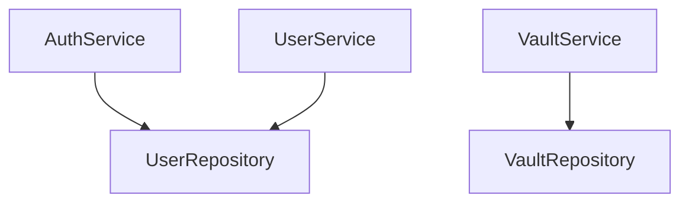

# 📦 Services Package (`services`)

Encapsula la **Lógica de Negocio** de la aplicación. Es el núcleo funcional que orquesta operaciones entre los Handlers y los Repositories.

---

## Responsabilidades

1. **Reglas de negocio**: Validaciones lógicas (email duplicado, permisos de acceso, etc.)
2. **Transformación de datos**: Convertir DTOs → Models y viceversa
3. **Coordinación**: Puede llamar a múltiples repositories para completar una operación
4. **Seguridad de acceso**: Filtrar siempre por `UserID`
5. **Gestión de tokens**: Generar y firmar JWT

---

## Independencia de Transporte

Los services **NO** dependen de `echo.Context` ni de HTTP. Podrían ser invocados desde:
- Handlers HTTP (uso actual)
- CLI tools
- gRPC services
- Workers/cron jobs

---

## Archivos e Interfaces

### `auth_service.go` — `AuthService`

Gestiona el ciclo completo de autenticación.

```go
type AuthService interface {
    Register(registerDTO dto.RegisterDTO) error
    Login(loginDTO dto.LoginDTO) (string, error)
}
```

#### `Register` — Registro de Usuario

| Paso | Acción |
|---|---|
| 1 | Verificar si el email ya existe (`FindByEmail`) |
| 2 | Si existe → retorna `"email already registered"` |
| 3 | Hashear la contraseña con Argon2id (`security.HashPassword`) |
| 4 | Extraer nombre del email (parte antes de `@`) |
| 5 | Crear usuario (`userRepo.Create`) |
| 6 | Crear perfil con nombre auto-generado (`userRepo.CreateProfile`) |

> 💡 Al registrarse, se crea automáticamente un `UserProfile` con el nombre derivado del email.

#### `Login` — Inicio de Sesión

| Paso | Acción |
|---|---|
| 1 | Buscar usuario por email (`FindByEmail`) |
| 2 | Si no existe → retorna `"invalid credentials"` |
| 3 | Verificar contraseña (`security.VerifyPassword`) |
| 4 | Si no coincide → retorna `"invalid credentials"` |
| 5 | Generar token JWT con claims `user_id`, `email`, `exp` |
| 6 | Firmar con `JWT_SECRET` (HS256) |
| 7 | Retornar token al handler |

**Claims del JWT:**

```go
jwt.MapClaims{
    "user_id": user.ID,      // UUID del usuario
    "email":   user.Email,    // Email
    "exp":     +12h,          // Expiración (12 horas)
}
```

---

### `vault_service.go` — `VaultService`

CRUD completo de items de la bóveda con transformación DTO → Model.

```go
type VaultService interface {
    CreateItem(userID string, input dto.CreateVaultItemDTO) (*models.VaultItem, error)
    GetItems(userID string) ([]models.VaultItem, error)
    GetItem(userID string, itemID string) (*models.VaultItem, error)
    UpdateItem(userID string, itemID string, input dto.UpdateVaultItemDTO) (*models.VaultItem, error)
    DeleteItem(userID string, itemID string) error
}
```

| Método | Lógica |
|---|---|
| `CreateItem` | Transforma DTO → `VaultItem` + `VaultSecret`, delega a `repo.Create` |
| `GetItems` | Lista items sin secretos (optimización de rendimiento) |
| `GetItem` | Obtiene item con `Preload("Secret")` para descifrado en cliente |
| `UpdateItem` | Partial update — solo actualiza campos no vacíos del DTO |
| `DeleteItem` | Verifica propiedad → soft delete |

#### Partial Update (UpdateItem)

El servicio aplica un patrón de actualización parcial:

```go
// Solo se actualizan campos que vienen con valor
if input.Title != "" {
    item.Title = input.Title
}
if input.FolderID != nil {
    item.FolderID = input.FolderID
}
if input.Trashed != nil {
    item.Trashed = *input.Trashed
}
```

> Los campos `*string` y `*bool` (punteros) permiten distinguir entre "no enviado" (`nil`) y "valor vacío" (`""`/`false`).

---

### `user_service.go` — `UserService`

Gestión del perfil público del usuario.

```go
type UserService interface {
    GetProfile(userID string) (*models.UserProfile, error)
    UpdateProfile(profile *models.UserProfile) error
}
```

| Método | Descripción |
|---|---|
| `GetProfile` | Delega a `userRepo.FindProfileByUserID` |
| `UpdateProfile` | Delega a `userRepo.UpdateProfile` (GORM Save) |

---

## Inyección de Dependencias

```go
// Services dependen de Repositories (interfaces)
authService := services.NewAuthService(userRepo)
vaultService := services.NewVaultService(vaultRepo)
userService := services.NewUserService(userRepo)
```


