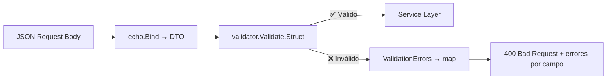

# 📦 Validator Package (`validator`)

Configura y expone la instancia global del validador de datos usando [go-playground/validator](https://github.com/go-playground/validator). También provee utilidades para formatear errores de validación.

---

## Responsabilidades

- Proveer una instancia singleton de `validator.Validate` para toda la aplicación
- Centralizar la lógica de validación de structs (DTOs)
- Formatear errores de validación en un mapa legible para respuestas JSON

---

## Archivos

### `validator.go` — Instancia Global

```go
var Validate = validator.New()
```

Una única instancia compartida por todos los handlers. Evita crear un nuevo validador en cada petición.

---

### `errors.go` — Formateo de Errores

```go
func ValidationErrors(err error) map[string]string
```

Transforma los errores de `go-playground/validator` en un mapa `campo → regla_violada`:

```go
// Input con errores:
// { "email": "", "password": "123" }

// Output formateado:
{
    "Email": "required",
    "Password": "min"
}
```

Esto permite al frontend mostrar errores específicos por campo.

---

## Tags de Validación Usados

| Tag | Significado | Ejemplo de uso |
|---|---|---|
| `required` | Campo obligatorio | `Email`, `Password`, `Title` |
| `email` | Formato email válido | `Email` |
| `min=N` | Longitud mínima | `Password` (min=8), `Name` (min=1) |
| `max=N` | Longitud máxima | `Name` (max=50) |
| `url` | Formato URL válida | `AvatarURL` |
| `oneof=a b c` | Valor debe ser uno de los listados | `ItemType`, `Language` |
| `omitempty` | Solo validar si el campo no está vacío | Campos opcionales en updates |

---

## Uso en Handlers

```go
// En cualquier handler:
if err := validator.Validate.Struct(&dto); err != nil {
    return c.JSON(http.StatusBadRequest, echo.Map{
        "error": validator.ValidationErrors(err),
    })
}
```

Esto asegura que **solo datos válidos** lleguen a la capa de Service.

---

## Flujo de Validación


